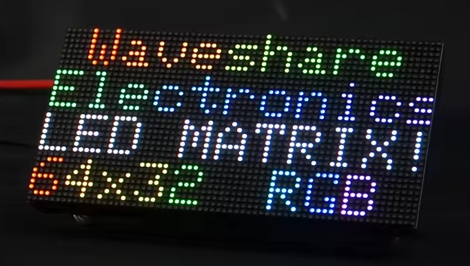
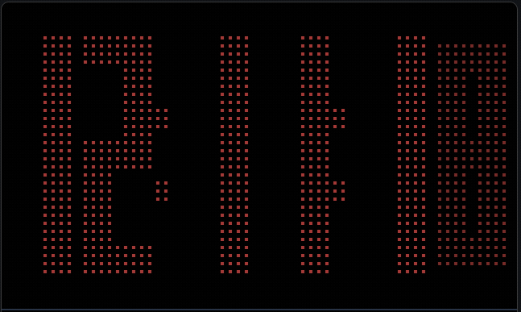
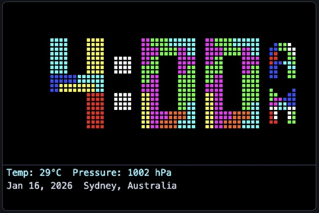
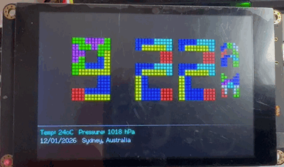
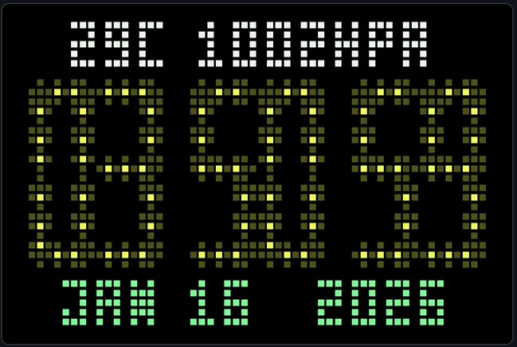

# ESP32 Touchdown RGB LED Matrix (HUB75) Retro Clock

<!-- Note: Update version badge below when FIRMWARE_VERSION changes in include/config.h -->


A retro-style RGB LED Matrix (HUB75) clock for the **ESP32 Touchdown** that emulates a **64×32 RGB LED Matrix Panel (HUB75)** on a 480×320 ILI9488 TFT display. Features multiple clock display modes including classic 7-segment with morphing animations and Tetris-style animated blocks, WiFi connectivity, NTP time synchronization, capacitive touch support, and a web-based configuration interface.



## Clock Display Modes

The clock offers multiple display styles that you can select via the web interface or configure to automatically cycle through:

### Morphing (Classic) Mode
Smooth LED digit morphing animations based on [Morphing Clock](https://github.com/hwiguna/HariFun_166_Morphing_Clock) by Hari Wiguna (HariFun).




### Tetris Animation Mode
Animated Tetris blocks fall into place to form time digits using [TetrisAnimation](https://github.com/toblum/TetrisAnimation) by Tobias Blum (toblum).



 

### Morphing (Remix) Mode
Enhanced morphing clock with segment-based animations and bezier curves based on [MorphingClockRemix](https://github.com/lmirel/MorphingClockRemix) by lmirel.



### Mode Selection
- **Manual Selection**: Choose your preferred clock mode from the web interface
- **Auto-Cycle**: Enable automatic rotation through all clock modes
- **Configurable Interval**: Set how long to display each mode (1-60 minutes) before cycling to the next

**Features:**
- **Unified color theming**: All digits use the user-configured LED color from WebUI
- **Independent sensor/date colors**: Customizable colors for sensor data and date display (Remix mode)
- **Subtle colon dimming**: Colons display at 75% brightness for visual separation
- **Optimized layout**: Sensor data at top, clock centered, date at bottom with proper spacing
- **Configurable scaling**: Independent horizontal and vertical pixel pitch control
- **Full screen usage**: 480×320 TFT display fully utilized with adjustable margins

More clock modes coming soon: Analog, Binary, Word Clock, and more!

## Features

### Display
- **64×32 Virtual RGB LED Matrix (HUB75)** emulation on 480×320 TFT display
- Emulates physical RGB LED Matrix Panel with HUB75 protocol characteristics
- **Multiple Clock Display Modes**:
  - **Morphing (Classic) Mode**: LED digits with smooth morphing animations (based on [Morphing Clock](https://github.com/hwiguna/HariFun_166_Morphing_Clock) by Hari Wiguna)
  - **Tetris Mode**: Animated Tetris blocks fall into place to form time digits (using [TetrisAnimation](https://github.com/toblum/TetrisAnimation) by Tobias Blum)
  - **More modes coming soon**: Analog, Binary, Word Clock, and more!
- **Mode Selection**: Choose clock mode via web interface or enable auto-rotation
- **Auto-Rotation**: Automatically cycle through clock modes at configurable intervals
- **Adjustable LED appearance**: diameter, gap, color, and brightness
- **Status bar** showing WiFi, IP address, and date
- **Landscape orientation** optimized for desktop/shelf display
- **Higher resolution** (480×320 vs 320×240) for crisp display
- **Animated startup splash**: Cinematic LED matrix demonstration with RGB sweep, pixel noise, grid size display, and "HUB75 LED MATRIX EMULATOR" text animation (touch to skip)

### Connectivity
- **WiFiManager** for easy WiFi setup (AP mode fallback)
- **Web interface WiFi reset** option for remote WiFi reconfiguration
- **NTP time synchronization** with IANA timezone support
- **Web-based configuration** interface accessible from any browser
- **OTA firmware updates** for easy maintenance
- **Live display mirror** in web UI showing real-time framebuffer

### Touch Interface
- **Capacitive touch support** (FT6236/FT6206 controller)
- **Rotation-aware touch mapping**: Automatically adjusts touch coordinates when display is flipped
- **Calibration support**: Fine-tune touch accuracy with X/Y offset adjustments
- **Single tap**: Switch between clock display modes (Morphing ↔ Tetris)
- **Long press (3 seconds)**: Display on-screen settings and diagnostics
  - **User Settings Page**: View all configurable settings (clock mode, time format, LED appearance, etc.)
    - **Interactive "Flip Display" button**: Rotate display 180° directly from touch screen
  - **System Diagnostics Page**: View network status, hardware info, system resources, uptime
    - **Interactive "Reset WiFi" button**: Clear credentials and restart in AP mode
    - **Interactive "Reboot" button**: Restart the device
  - **Page navigation buttons**: < > buttons to navigate between pages, X button to exit back to clock

### Configuration
- **Clock Display Mode**: Choose between Morphing (Classic), Tetris, or enable auto-rotation
- **Auto-Rotation**: Cycle through clock modes every N minutes (configurable interval)
- Timezone selection from dropdown (88 timezones across 13 geographic regions)
- NTP server selection from dropdown (9 preset servers including global and regional pools)
- 12/24 hour time format
- Date format selection (5 formats: ISO, European, US, German, Verbose)
- LED diameter (1-10 pixels)
- LED gap spacing (0-8 pixels)
- LED color (RGB color picker with instant preview)
- Backlight brightness (0-255)
- Debug level (Off, Error, Warning, Info, Verbose) - adjustable at runtime

### System Diagnostics
- Real-time system status monitoring in web interface:
  - Time & Network: current time, date, WiFi status, IP address
  - Hardware: board type, display model, sensor status, firmware version, OTA status
  - System Resources: uptime, free heap, heap usage percentage, CPU frequency
  - Debug Settings: runtime-adjustable logging verbosity
- Enhanced serial logging with before/after change tracking
- Human-readable formatting for uptime and memory usage

## Hardware Requirements

### Board: ESP32 Touchdown


The ESP32 Touchdown is a professional-grade ESP32 development board by Dustin Watts with integrated:
- **ESP32-WROOM-32D** processor (2.4GHz WiFi, Bluetooth)
- **ILI9488 TFT display** (480×320 pixels, 16-bit color, 4-wire SPI)
- **FT62x6 capacitive touch controller** (FT6236/FT6206, I2C address 0x38)
- **MCP73831/SD8016 battery management** (LiPo charging and operation)
- **CP2102 USB-to-UART bridge** for programming
- **APK2112/AP7365 3.3V regulator**
- **GPIO32 backlight control** (PWM capable)
- **GPIO26 passive buzzer**
- **microSD card slot** (SD mode)
- **USB-C connector** for power and programming
- **Stemma/JST-PH I2C connector** for external sensors
- **7+ additional GPIO breakout pins** (12, 13, 14, 16, 17, 33, 34)

**GitHub Repository:** [https://github.com/DustinWatts/esp32-touchdown](https://github.com/DustinWatts/esp32-touchdown)

### Pin Configuration
The project uses the standard ESP32 Touchdown pin configuration:

**TFT Display Pins** (ILI9488, 4-wire SPI, defined in `include/User_Setup.h`):
```cpp
TFT_MOSI   23   // SDI (MOSI)
TFT_SCLK   18   // SPI Clock
TFT_CS     15   // Chip Select
TFT_DC      2   // Data/Command (DC_RS)
TFT_RST     4   // Reset
TFT_BL     32   // Backlight control (PWM)
TFT_MISO   -1   // 4-wire SPI (no MISO)
```

**Touch Controller Pins** (FT62x6 FT6236/FT6206 via I2C @ 0x38):
```cpp
SDA        21   // I2C Data
SCL        22   // I2C Clock
IRQ        27   // Touch Interrupt
```

**microSD Card Pins** (SD mode):
```cpp
GPIO25     CD/DAT3
GPIO23     CMD (shared with TFT_MOSI)
GPIO18     CLK (shared with TFT_SCLK)
GPIO19     DAT0
```

**Additional Hardware Pins**:
```cpp
GPIO26     Passive Buzzer
GPIO35     Battery Voltage Divider
```

**Available GPIO Breakout** (7+ pins):
```cpp
GPIO12, GPIO13, GPIO14, GPIO16, GPIO17
GPIO33, GPIO34 (INPUT only)
```

**Note:** SPI pins (SCK, SDO, SDA, SCL, SDI) are also broken out but shared with TFT and SD card.

### Purchase Links
- [Tindie: ESP32 Touchdown](https://www.tindie.com/products/dustinwattsnl/esp32-touchdown/)
- [Lectronz (Netherlands)](https://lectronz.com/products/esp32-touchdown)
- [Eplop Electronics (UK)](https://store.eplop.co.uk/product/esp32touchdown/)
- [PCBWay (China)](https://www.pcbway.com/project/gifts_detail/ESP32_TouchDown.html)

## Software Setup

### Prerequisites
- [Visual Studio Code](https://code.visualstudio.com/)
- [PlatformIO IDE extension](https://platformio.org/install/ide?install=vscode)
- USB-C cable (for ESP32 Touchdown)

### Installation Steps

#### 1. Clone or Download the Project
```bash
git clone <repository-url>
cd ESP32_Touchdown_Retro_Clock
```

#### 2. Open in VS Code with PlatformIO
```bash
code .
```

#### 3. Build the Project
- Click the PlatformIO icon in the sidebar
- Select "Build" or press `Ctrl+Alt+B` (Windows/Linux) / `Cmd+Shift+B` (Mac)

#### 4. Upload Firmware
- Connect your Touchdown via USB-C
- Select "Upload" from PlatformIO menu or press `Ctrl+Alt+U`
- Wait for upload to complete (~30 seconds)

#### 5. Upload Filesystem (Web UI)
- Select "Upload Filesystem Image" from PlatformIO menu
- This uploads the web interface files to LittleFS
- Wait for upload to complete (~10 seconds)

#### 6. Configure WiFi
On first boot, the device will create a WiFi access point:

1. Look for WiFi network: **Touchdown-RetroClock-Setup**
2. Connect to this network (no password required)
3. A captive portal should open automatically
4. If not, navigate to `http://192.168.4.1`
5. Click "Configure WiFi"
6. Select your WiFi network and enter the password
7. Click "Save"
8. The device will restart and connect to your WiFi

**WiFi Reset Options:**
- **Web Interface Reset**: Use the web UI to reset WiFi credentials remotely
- **USB Serial**: Connect via USB and reset via serial commands

#### 7. Access the Web Interface
1. Check your router for the device's IP address, or
2. Look at the TFT display's status bar (bottom) for the IP
3. Open a web browser and navigate to: `http://<device-ip>`
4. You should see the configuration interface with a live display mirror

## Configuration

### Web Interface
Access the web interface at `http://<device-ip>` to configure:

**Display Mirror**
- Live view of the 64×32 RGB LED Matrix (HUB75) framebuffer with real-time updates

**Clock Display Mode**
- **Display Style**: Choose between Morphing (Classic) or Tetris Animation
- **Mode Switching**: Select Manual or Auto-Cycle
- **Cycle Interval**: Set rotation interval (1-60 minutes) when auto-cycling is enabled

**Time & Date Settings**
- **Timezone**: Dropdown selector with 88 timezones organized by 13 geographic regions
  - Africa, Americas, Antarctica, Arctic, Asia, Atlantic, Australia, Europe, Indian, Pacific, USA, UTC, and Etc
- **NTP Server**: Dropdown selector with 9 preset servers:
  - Global Pool (pool.ntp.org)
  - Google (time.google.com), Cloudflare (time.cloudflare.com), Apple (time.apple.com), Microsoft (time.windows.com)
  - Regional pools: Australia, USA, Europe, Asia
- **Time Format**: Choose between 12-hour or 24-hour display
- **Date Format**: Choose from 5 formats:
  - YYYY-MM-DD (ISO 8601)
  - DD/MM/YYYY (European)
  - MM/DD/YYYY (US)
  - DD.MM.YYYY (German)
  - Mon DD, YYYY (Verbose, e.g., "Jan 07, 2026")
- **Temperature Unit**: Celsius (°C) or Fahrenheit (°F)

**LED Appearance**
- **LED Diameter**: Adjust the size of individual LED dots (1-10 pixels)
- **LED Gap**: Space between LEDs (0-8 pixels)
- **LED Color**: Use the color picker to choose any RGB color with instant preview
- **Brightness**: Adjust backlight brightness (0-255)
- **Morph Speed**: Adjust animation speed (1-50x) for morphing transitions
- **Flip Display**: Rotate display 180° for different mounting orientations

**System Controls**
- **Reset WiFi**: Clear WiFi credentials and restart in configuration mode
- **Reboot Device**: Restart the ESP32

**Debug Settings**
- **Debug Level**: Adjust serial logging verbosity at runtime (Off, Error, Warning, Info, Verbose)

### System Diagnostics Panel
The web interface displays comprehensive real-time system information:

**Time & Network**
- Current time and date
- WiFi network status
- IP address

**Hardware**
- Board: ESP32 Touchdown
- Display: 480×320 ILI9488
- Sensors: Status of connected sensors (when implemented)
- Firmware: Current version
- OTA: Over-the-air update status

**System Resources**
- Uptime: System uptime formatted as days/hours/minutes
- Free Heap: Available memory
- Heap Usage: Used/Total memory with percentage
- CPU Freq: Processor frequency (typically 240 MHz)

**Debug Settings**
- Debug Level: Runtime-adjustable logging verbosity
- Log Output: Serial @ 115200 baud

All configuration changes are applied instantly without requiring a save button.

### Configuration File
Settings are stored in `include/config.h`. Default values:

```cpp
#define DEFAULT_TZ "Australia/Sydney"
#define DEFAULT_NTP "pool.ntp.org"
#define DEFAULT_24H true
#define DEFAULT_LED_DIAMETER 7
#define DEFAULT_LED_GAP 0
#define DEFAULT_LED_COLOR_565 0xF800  // Red
#define STATUS_BAR_H 70  // pixels
```

#### Morphing (Remix) Mode Display Configuration

The Morphing (Remix) mode (Mode 3) uses configurable pixel pitch values to control the display size:

```cpp
#define MORPH_PITCH_X 8    // Horizontal pitch (7-10 recommended)
#define MORPH_PITCH_Y 9    // Vertical pitch (8-10 recommended)
```

**⚠️ CRITICAL:** When you change `MORPH_PITCH_X` or `MORPH_PITCH_Y` in `include/config.h`, you **MUST** also update the matching values in `data/app.js` (lines 377-378) for the WebUI mirror to display correctly!

**Example configurations:**

```cpp
// Smaller display with margins (fits on screen):
#define MORPH_PITCH_X 7    // 64*7=448px width (16px margins)
#define MORPH_PITCH_Y 8    // 32*8=256px height (32px margins)

// Current balanced setting:
#define MORPH_PITCH_X 8    // 64*8=512px width (clips edges slightly)
#define MORPH_PITCH_Y 9    // 32*9=288px height (16px margins)

// Maximum size (uses full height):
#define MORPH_PITCH_X 7    // 64*7=448px width (16px margins)
#define MORPH_PITCH_Y 10   // 32*10=320px height (full height)
```

Remember to update both files after changing these values!

### Sensor Configuration (Optional)
The clock supports optional I2C temperature/humidity/pressure sensors connected via the Stemma/JST-PH I2C connector on the ESP32 Touchdown board.

**Supported Sensors:**
- **BME280**: Temperature, Humidity, Pressure (I2C: 0x76 or 0x77)
- **BMP280**: Temperature, Pressure (I2C: 0x76 or 0x77)
- **BMP180**: Temperature, Pressure (I2C: 0x77 only)
- **SHT3X**: Temperature, Humidity (I2C: 0x44 or 0x45)
- **HTU21D**: Temperature, Humidity (I2C: 0x40) - **DEFAULT**

**To enable a sensor**, edit `include/config.h` and uncomment ONE sensor type:
```cpp
// Choose your sensor type by uncommenting ONE of the following:
// #define USE_BME280        // BME280: Temperature, Humidity, Pressure
// #define USE_BMP280        // BMP280: Temperature, Pressure (no humidity)
// #define USE_BMP180        // BMP180: Temperature, Pressure (no humidity)
// #define USE_SHT3X         // SHT3X: Temperature, Humidity (no pressure)
#define USE_HTU21D           // HTU21D: Temperature, Humidity (no pressure) - DEFAULT
```

**I2C Connection:**
- The sensors share the I2C bus with the FT62x6 touch controller
- Connect via the Stemma/JST-PH connector (GPIO21/SDA, GPIO22/SCL)
- Or use the SDA/SCL breakout pins on the board

**Note:** Sensor readings will appear in the web UI diagnostics panel and serial output. The clock will work without a sensor - it will simply show "None detected" in the diagnostics.

### Security Configuration
**IMPORTANT**: Change the OTA password before deploying:

Edit `include/config.h`:
```cpp
#define OTA_PASSWORD "your-secure-password-here"
```

## Usage

### Display Layout
```
┌─────────────────────────────────────┐
│                                     │
│        16:30:45                     │  ← Clock digits (64×32 RGB LED Matrix HUB75)
│                                     │
│                                     │
├─────────────────────────────────────┤
│ IP: 192.168.1.100                   │  ← Status bar
│ 2026-01-07  Sydney, Australia       │
└─────────────────────────────────────┘
```

### RGB LED Matrix (HUB75) Emulation
- Each "LED" is rendered as a square pixel of adjustable size
- Emulates physical 64×32 RGB LED Matrix Panel with HUB75 protocol characteristics
- Pitch (spacing) is automatically calculated: `min(480/64, 250/32) = 7 pixels per LED`
- This gives a display size of 480×224 pixels for the clock
- Status bar occupies the bottom 70 pixels

### RGB LED Status Indicators
The ESP32 Touchdown board can provide visual feedback through GPIO status during startup and operation:

| Color | Meaning |
|-------|---------|
| **Blue** | Device starting up / Connecting to WiFi |
| **Green Flash** | WiFi connected successfully / Sensor detected / NTP configured |
| **Yellow** | BOOT button pressed during startup |
| **Yellow Flash** | No sensor detected (normal if no sensor installed) |
| **Red** | WiFi reset confirmed / WiFi connection failed |
| **Purple** | WiFi config portal active (AP mode) |

The RGB LED will turn off once the device is fully operational.

### API Endpoints
The device provides a simple REST API:

- `GET /` - Main web interface
- `GET /api/state` - System state (JSON)
  ```json
  {
    "time": "16:30:45",
    "date": "2026-01-07",
    "wifi": "YourNetwork",
    "ip": "192.168.1.100",
    "tz": "Australia/Sydney",
    "ntp": "pool.ntp.org",
    "use24h": true,
    "dateFormat": 0,
    "ledDiameter": 5,
    "ledGap": 0,
    "ledColor": 16711680,
    "brightness": 255,
    "uptime": 3600,
    "freeHeap": 180000,
    "heapSize": 320000,
    "cpuFreq": 240,
    "debugLevel": 3,
    "board": "ESP32 Touchdown",
    "display": "480×320 ILI9488",
    "sensors": "None detected",
    "firmware": "<FIRMWARE_VERSION from config.h>",
    "otaEnabled": true
  }
  ```
- `GET /api/timezones` - List of 88 timezones grouped by 13 geographic regions (JSON)
- `POST /api/config` - Update configuration (JSON body)
  - Accepts: tz, ntp, use24h, dateFormat, ledDiameter, ledGap, ledColor, brightness, debugLevel
  - Logs before/after values for all changed fields to Serial monitor
  - Returns: `{"ok": true}` on success
- `POST /api/reset-wifi` - Reset WiFi credentials and restart device in AP mode
  - Returns: `{"status": "WiFi reset initiated. Device will restart..."}` on success
  - Device will restart and enter WiFi configuration mode
- `GET /api/mirror` - Raw framebuffer data (4096 bytes, 64×32 matrix, RGB565 format: 2 bytes per pixel)

## OTA Updates

### Using Arduino OTA
Once the device is connected to WiFi, you can update firmware wirelessly:

1. In PlatformIO, ensure the device is on the same network
2. The device should appear as "Touchdown-RetroClock" in the upload targets
3. Select it and upload as normal
4. Default password: "change-me" (change this in `config.h`!)

### Using Web OTA
The ArduinoOTA service runs on port 3232. You can use the Arduino IDE's network port feature or write a custom web OTA interface.

## Troubleshooting

### Display Issues

**Problem**: Display is blank or shows garbage
- **Solution**: Check TFT pin configuration in `include/User_Setup.h`
- Verify you have the correct ESP32 Touchdown variant
- The ESP32 Touchdown uses ILI9488 driver with 4-wire SPI interface

**Problem**: Display is upside down
- **Solution**: TFT is configured for landscape mode. Adjust `tft.setRotation()` in `main.cpp` if needed

**Problem**: Colors are wrong
- **Solution**: Verify RGB to RGB565 conversion in `rgb888_to_565()` function

### WiFi Issues

**Problem**: Can't connect to WiFi AP
- **Solution**:
  - Restart the device
  - The AP appears on first boot or if WiFi credentials are invalid
  - AP SSID: "Touchdown-RetroClock-Setup"
  - Wait 30 seconds after boot for AP to start

**Problem**: Device won't connect to my WiFi
- **Solution**:
  - Verify password is correct
  - Check that your network is 2.4GHz (ESP32 doesn't support 5GHz)
  - Reset WiFi credentials using one of these methods:
    - Hold BOOT button for 3 seconds during power-up (yellow → red LED)
    - Send POST request to `/api/reset-wifi` from web interface
  - Device will restart in AP mode for reconfiguration

### Time Issues

**Problem**: Time is wrong
- **Solution**:
  - Check timezone setting (must be IANA format)
  - Verify internet connectivity (required for NTP)
  - Check NTP server is accessible
  - Wait a few minutes for NTP sync

**Problem**: Time doesn't update
- **Solution**:
  - Check Serial monitor (115200 baud) for NTP sync messages
  - Verify firewall isn't blocking NTP (UDP port 123)

### Web Interface Issues

**Problem**: Can't access web interface
- **Solution**:
  - Verify device IP address from serial monitor or TFT display
  - Check that your computer is on the same network
  - Try `http://<ip>` and `http://<ip>/index.html`
  - Clear browser cache

**Problem**: Display mirror not updating
- **Solution**:
  - Check browser console for errors (F12)
  - Verify `/api/mirror` endpoint is accessible
  - Refresh the page

## Development

### Project Structure
```
ESP32_Touchdown_Retro_Clock/
├── data/                      # Web UI files (uploaded to LittleFS)
│   ├── index.html            # Main web interface with diagnostics panel
│   ├── app.js                # JavaScript for live updates, display mirror, and formatting utilities
│   └── style.css             # Stylesheet with status panel and footer styles
├── include/
│   ├── config.h              # Configuration constants including FIRMWARE_VERSION
│   ├── timezones.h           # 88 timezones across 13 geographic regions
│   └── User_Setup.h          # TFT_eSPI pin configuration
├── src/
│   └── main.cpp              # Main application code with enhanced logging and diagnostics
├── platformio.ini            # PlatformIO configuration
├── CHANGELOG.md              # Version history (updated for v2.0.0)
├── LICENSE                   # MIT License
└── README.md                 # This file
```

### Key Functions

#### Framebuffer Management
- `fbClear()` - Clear the entire framebuffer
- `fbSet(x, y, v)` - Set a single pixel with intensity (0-255)

#### Digit Rendering
- `makeDigit7Seg(d)` - Generate 7-segment digit bitmap
- `drawBitmapSolid()` - Draw a bitmap to framebuffer
- `drawSpawnMorphToTarget()` - Animated morph effect for digit changes

#### Display Rendering
- `drawFrame()` - Main frame rendering (clock digits)
- `renderFBToTFT()` - Convert framebuffer to TFT display with LED emulation
- `computeRenderPitch()` - Calculate LED spacing based on display size

#### Configuration
- `loadConfig()` - Load settings from Preferences
- `saveConfig()` - Save settings to Preferences
- `handlePostConfig()` - Process configuration updates from web API

### Building Custom Variants

#### Change RGB LED Matrix (HUB75) Size
Edit `platformio.ini`:
```ini
build_flags =
  -DLED_MATRIX_W=128   # Change width (e.g., 128 for 128×64 panel)
  -DLED_MATRIX_H=64    # Change height
```

Note: Web interface constants must match (`data/app.js`):
```javascript
const LED_W = 128;
const LED_H = 64;
```

#### Add Different Display Controller
Edit `include/User_Setup.h`:
```cpp
// Change from ILI9488 to ST7789 (for different hardware)
#define ST7789_DRIVER
```

## Future Enhancements

See `CHANGELOG.md` for planned features:
- Additional display modes (date, temperature, messages)
- Color schemes and themes
- Touch screen support
- MQTT integration

## Documentation

Additional technical documentation is available in the [`/doc`](doc/) folder:
- [Architecture Overview](doc/ARCHITECTURE.md) - System architecture and design
- [Codebase Review](doc/CODEBASE_REVIEW.md) - Detailed code analysis
- [CYD Porting Guide](doc/CYD_PORTING_GUIDE.md) - Migration from ESP32-2432S028
- [Migration Notes](doc/MIGRATION_NOTES.md) - Version upgrade notes

## Contributing

Contributions are welcome! Please feel free to submit pull requests or open issues for bugs and feature requests.

## License

This project is licensed under the MIT License - see the LICENSE file for details.

## Acknowledgments

- **Hardware:** [ESP32 Touchdown](https://github.com/DustinWatts/esp32-touchdown) by Dustin Watts
- **Morphing Clock:** [Morphing Clock](https://github.com/hwiguna/HariFun_166_Morphing_Clock) by Hari Wiguna (HariFun)
- **Tetris Clock Animation:** [TetrisAnimation](https://github.com/toblum/TetrisAnimation) by Tobias Blum (toblum)
- Built using [PlatformIO](https://platformio.org/)
- TFT display library: [TFT_eSPI](https://github.com/Bodmer/TFT_eSPI) by Bodmer
- WiFi management: [WiFiManager](https://github.com/tzapu/WiFiManager) by tzapu
- Graphics library: [Adafruit GFX Library](https://github.com/adafruit/Adafruit-GFX-Library) by Adafruit
- JSON parsing: [ArduinoJson](https://arduinojson.org/) by Benoit Blanchon
- Inspired by classic RGB LED Matrix (HUB75) clocks and morphing digit displays
- Software developed by Anthony Clarke with assistance from [Claude Code](https://claude.com/claude-code)

## Support

For issues, questions, or suggestions:
- **ESP32 Touchdown Hardware:** [https://github.com/DustinWatts/esp32-touchdown](https://github.com/DustinWatts/esp32-touchdown)
- **Software Developer:** [@anthonyjclarke.bsky.social](https://bsky.app/profile/anthonyjclarke.bsky.social)
- Check the troubleshooting section above
- Review the [CHANGELOG.md](CHANGELOG.md) for known issues and version history

The web interface footer includes quick links to the ESP32 Touchdown GitHub repository and developer profiles.

## Version History

See [CHANGELOG.md](CHANGELOG.md) for detailed version history.

**Current Version**: Defined in [`include/config.h`](include/config.h) as `FIRMWARE_VERSION`

---

**Enjoy your retro RGB LED Matrix (HUB75) clock!** ⏰
